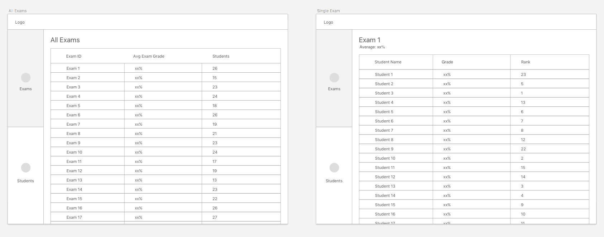

## Coding test

This repository contains a small application that consumes test score data and exposes the data via a REST API.  Your job is to build a UI on top of the API, based on provided wireframes.

#### About the application

The application consumes data from `https://live-test-scores.herokuapp.com/scores`, using the [Server-Sent Events](https://html.spec.whatwg.org/multipage/server-sent-events.html#server-sent-events) protocol and stores the results in memory. This means that there is no data on start up, and test scores will stream in over time.

The data is exposed via the following REST API:

1. `/api/v1/students` lists all students that have received at least one test score
2. `/api/v1/students/{id}` lists the test results for the specified student, and provides the student's average score across all exams
3. `/api/v1/exams` lists all the exams that have been recorded
4. `/api/v1/exams/{number}` lists all the results for the specified exam, and provides the average score across all students

#### Extending the application

We'd like you to build a UI on top of the existing API, allowing a user to browse the list of exams.
While design is important to us,  we don't expect you to be a designer so we we're not looking for you to fill in the visual design details.
However, we do expect you to be able to craft an intuitive and friendly user experience.

We've provided a wireframe for these two views below: an exam list view and an exam detail view.



We primarily use React and Redux to build the LaunchDarkly front-end.
However, there are a lot of tools, libraries, and frameworks out there these days for front-end web development, and it's our experience that good developers can easily pick up new frameworks.
To create a more level playing field for all applicants and to allow us to more easily compare solutions, we have a few restrictions on what 3rd-party libraries can be used:

* The solution only needs to work in modern browsers (one or both of latest Chrome/Firefox)
* No JavaScript frameworks are allowed (React, Angular, etc). The solution should be achievable with modern vanilla JS
  * JS variants such as Typescript are allowed
  * Polyfills are allowed
  * Babel is allowed
* No CSS frameworks are allowed (Bootstrap, Bulma, etc)
  * Pre/post processors such as LESS, SASS, or PostCSS are allowed
  * Resets/normalizers are allowed

#### Running the application

Install Yarn
```
https://yarnpkg.com/en/docs/install
```

Run Yarn to install dependencies
```sh
$ yarn
```

Running the app (note that you'll need _at least_ Node v9.x)
```sh
$ yarn start
```

Running the tests
```sh
$ yarn test
```

By default the application starts up at `http://localhost:4000`

#### Submitting your solution

When you're done, commit your solution and push it to this GitHub repository. You can submit the repository url using the Greenhouse link we emailed you.

Your solution must meet the following requirements:

- We should be able to run it using the instructions in this README.
- The exam list and detail views should display data from the API properly based on the wireframe above.
- The user experience should be intuitive and user-friendly.
- Your solution must respect the constraints above.

#### What is the next step?

One we have reviewed your solution, we will reach back out to you and set up a time for
the next stage of the interview process.

You will work with one or two people from our team to build some extensions on top of your solution. This gives us an opportunity to work through a few problems together.

Here are a few tips so you know what to expect:
- Be prepared to walk someone through your solution.
- Think about a couple of ways you could improve your solution.
- You will have access to all the tools you would normally have access to on the job.

#### Frequently asked questions

##### What is the expected amount of time I should spend on this?

We fully respect and understand that circumstances are different for everyone.

We recommend that you spend around 3 hours. If you are not able to complete any of the required steps from the "Submitting your solution" section above, send us a note when you submit your solution.

##### Should I zip up my code or push to this GitHub repository?

Please commit your code and push it to this repository. You can submit the repository url using the Greenhouse link we emailed you.

##### Will the data always be valid? Will the payload always contain a JSON object with the required 3 properties with valid values?

Yes.

##### Do I need to implement the student views?

No, only the exam views are required.

##### The instructions say that "test scores will stream in over time". Do I need to automatically update the page as new API data arrives?

No, updating the UI after the initial API request is not required.

##### Do I need to implement pagination for the exam and/or student list views?

No, pagination is not required.

##### Is it OK to use a client-side router to make things easier?

That's OK. Please mention that in your README for the reviewer.
